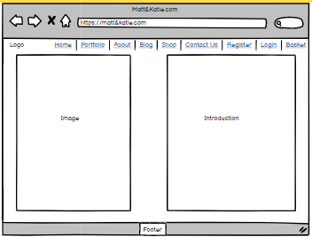
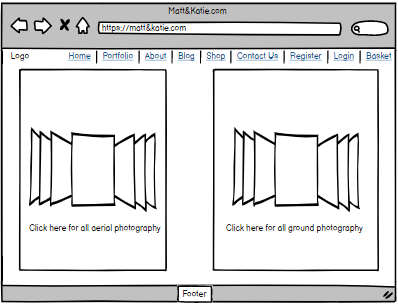
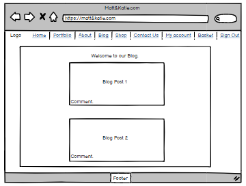
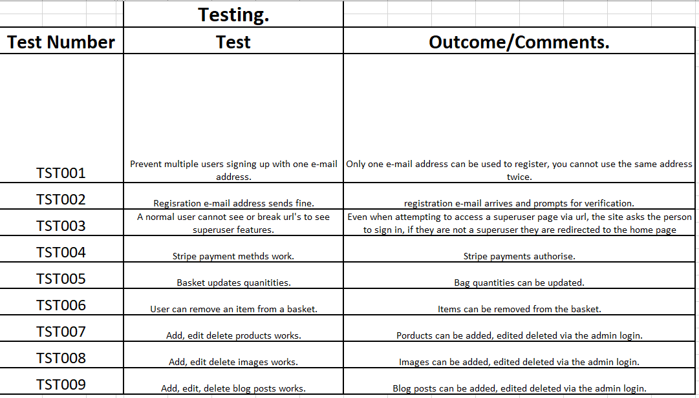
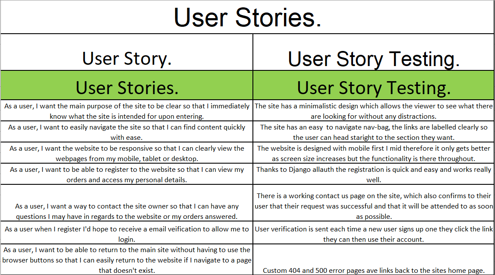

# **_Milestone-Project-4-Matt&Katie.com**

# **_Introduction:_**

The site matt&Katie.com is created for myself and my partner to post our photography and sell prints to our customers. On the site, visitors will also be able to read our blog where we will publish stories from our travels. Registered Users will be able to  comment their thoughts and any suggestions for a photography shoot. Registered users will also be able to update their shipping details i.e address or payment their details.

* Heroku App Login Details
Username: superuser,
Password: superuser1

# **_Purpose:_**

The website above was created for the purpose of achieving the fourth Milestone Project for the Code 
Institute's Full Stack Developer course.The website was developed using the knowledge gained from all previous models
throughout the course and the final Django module.

# *User Stories:*

# *The Surface Plane:*

### *The font:*

With the site being focused to showcase photography, the lato font at weight 300 from google fonts has been chosen to allow the viewers to be able to read quickly and efficiently. Using such a sleek and simple font means that there is no attention taken away from the imagery. Along with the colours being used are very simple with just a black and white colour pallet so that the colours on the photographs are what the viewer notices first. The weight 300 provides a sleek look to the site, smaller weights were too thin and hard to read where in contrast greater font weight was too bulky and took away from the websites sleek design.

### *The imagery:*

The sites imagery only consists of the photographs that have been taken by the photographer. By doing this we don’t allow for any confusion as to what is owned by the siteadmin and therefore the photographers. There has been a decision to avoid background images so that it isn’t taking away from the foreground images again to avoid confusion or negative contrast between colours.

### *The colour scheme:*

The colour scheme for this site is monotone, since the main purpose of the site is to show off the photography, avoiding any 
vibrant colours has allowed the site to showcase it's purpose. Rather than adding lots of colours to the site the presentation has been worked on through adding things such as horizontal rules and card elements to diiferentiate site sections. Again the card elements are set to a pale grey in order to provide slight contrast from the background of the site to grab the users attention and distinguish themselves. This allows for a shadow effect behind the main object which is the imagery.

# *Skeleton:*

 
 
 

 
 
 
 
 
 
 
 
 

### *Database Design:* ###

# *Differences to design:*

In comparison to the initial design, the final layout of the site is far more sleek. The initial design included lots of boxes and thus seemed rather cluttered. In contrast the final design is far more sleek through the use of django crispy forms and bootstrap, it has allowed for a much more user friendly experience.
The initial nav-bar included too many links, the drop-down functionality taken from bootstrap has allowed this to be decreased by a large amount and thus looking far more pleasant to the eye and the functionality has also improved.
The inital home page design was a repeat of the portfolio page which was deemed unnecassary and would have just provoked more cluter on the site, instead the visitors of the site are greeted with a welcome message accompanied by a welcome image of the photographers. This also promotes the aim of the site which is to create an engaging community for people who love photography as oppose to a website which seems like its only purpose is to sell products.
Similarly through the use of the drop-down functionality of the bootstrap navbar, (for example) there are less pages as there no longer needs to be a page for the user to choose which category of photography they wish to browse. Instead they can select this from the dropdown.
Using django allauth for login and sign up has also allowed for the registration form to be shortened and the user can later choose to add their details but for pure registration only and e-mail and password is required.

# *Structure:*

Continuing from the above, the site has a sleek and minimalistic design, it flows well on laptops, bigger screens, medium and small devices. The structure varies between small and large devices in sense that it has been designed using mobile first design. all the features are displayed in single file on small screens by using bootsrap grid to give things the col-sm-12 classes. This stops the website from becoming so cluttered that it would be unusable on a small screen. Instead, when the user is reading they are focused on the paragraph they are reading and the picture comes below or above, but it is out of the way. An example of this is the about us page. Similarly, when browsing the shop or the gallery the user can scroll through and view each item one by one. As the screen get's wider, the layout grows with it and it begins to look even better on larger devices.

# *Scope:*

The planned features for the website are:

* Website Title/ Website Logo - The aim of this is to make the website look professional, and provide a link to the home page on larger screen devices.  

* Page Headings- Due to the vast feautures of the site each page has a heading on the top, the heading follows the same styling
throughout and ensures that the user isn't losing track of what page their on for example if they were to get distracted.

* A search bar- Anticipating many products and blog posts in the future, it will make it easy for users to find what they're searching for. For example a user maybe interested in buying an image of a specific place or they want to search for a blog post a friend has mentioned to them. Searching the site will enable a user to o this easier than having to manually look for what they want.

* Registration- A user can choose to register an account on the site, this allow them to save personal details, access previous order details and engage in blog posts by commenting their thoughts. 

* Login- A returning user can log back in and review all their previous orders, update persoal details and review their orders. 

* Admin- The admin section/superuser of the site can be used to add,edit and delete blog posts, gallery images and shop products.

* Flash messages- Functions such as registering, adding reviews, logging in and out of the site as well as editing
or removing reviews are all supported by flash messages which confirm the request have been actioned.

* Custom 404 and 500 error pages- Custom 404 page not found and 500 server error pages to ensure that a user can return to the sites home page hassle free should they come across one of these errors.

# *Website Features:*
### *Existing:*
* A website logo

* Page Headings

* A search bar- At the current stage users can only search the products using the search bar.

* Registration

* Login

* Admin Area.

* Flash messages- Using Toasts, flash messages have been used to display occurances within the site such as success or ail messages.

* Custom 404 and 500 error pages

### *Future:*

* Style the navbar in the mobile header so that it is more central, whilst it doesn't look bad or provide poor functionality it would possibly look better moving it more central.

* Adding commenting functionality to blog posts as at the moment there will not be user interaction in this part of the site, the posts are read me only and only admin are able to interact with the posts.

* Allow users to use the search function on the site for more than just the products in allignment with the planned features.

Reason for lack of these being included at this time is the time factor. Due to still learning the framwork, how it works, wat it is capable and so one sometimes things take longer than can be anticipated and deadlines have to be met.

# *Technologies:* 

## *Languages used:*

* HTML
* CSS
* Javascript
* python

## *Frameworks, Libraries and programs Used:*

* Bootstrap
    * Used to assist in the reponsivness and functionality of the site.
* Jquery
    * Used to help implement Materialize features with in the app.
* Django
    * The Django framework was used to develop the web app.
* MySQL
    * MySQL database was used to store the app data locally.
* Postgres
    * Postgres database was used to store the app data when deployed in Heroku.
* Heroku
    Heroku was used to deply this web app.
* Amazon Web Services (AWS)
    Used to store the site static folders( CSS and media files).
* Stripe Payment methods
    Stripe payment methods were used to handle secure payments on the site.
* Gmail
    Used to connect real email functionality.
* Django Countries
    Used to provide list of countries for user profile details and payment details.
* Django Crispy forms
    Used to Create neat looking forms by importing relevant forms into templates.
* Django Allauth
    Used to handle authorisation of user accounts within the site.
* Django Extensions
    Used to install pyparsing and pydot which I used to create the Erd.dot file.
* Visual Studio Code
    Installed briefy onto local machine as no documentation could be found on installing graphiz extenions in gitpod.
* Graphviz
    Installed to local machine to convert erd.dot file into erd.png file.
* Microsoft Office Excel
    Used to run testing of the site, allowing for a clean look of all the tests and testing results.
* Google Chrome Developer Tools
    * Google chrome built in developer tools were used to inspect page elements and help debug issues.
* Google Fonts
    * Google fonts are used throughout the project to import the Playfair Display and serif fonts.
* Font Awesome
    * Font awesome Icons were used for the Social media links contained in the Footer section of the website.
* Techsini
    * Multi Device Website Mockup Generator was used to create the Mock up image in the readme.md file.
* GitHub
    * GithHub is the hosting site used to store the source code for the Website.
* Git
    * Git is the version control software used to commit and push code to the GitHub repository 
    where the source code is stored.
* Balsamiq Wireframes
    * Used to create wireframes for User experience design.
* Favicon
    * Favicon.io was used to make the website favicon.

# *Testing:*

# *Deployment:*

## *Project Creation:*
I began by creating a new github repository, using as always the code institute template. I named this new repository 
'Matt_Katie_Milestone_4' and slected 'include all branches'. I then went onto gitpod and installed django using pip3 install django followed by django-admin start project matt_katie in the cli to start his new project. I thn created the env.py fie along with gitignore file which would ignore the env.py file as well as a few others such as sqlite3 to ignore my database. I then ran initial migrations using python3 manage.py migrate, after this I created a new superuser. The next thing to do do was make the inital commit to github. The last step was to download django allauth and once this was downloaded I froze the requirements and began setting up my base template.

## *Deployment:*##

I began the deployment stage by creating a new app in my Heroku account which is called 'matt-katie-milestone-4' and continued to the resources section where I set up Postgres. I then headed back to gitpod where I used the CLI to install dj_database_url and psycopg2-binary and froze these requirments. The next step was to import dj_database_url into settings.py. I then set up the new Database in settings.py. To do this I needed the Database_url from the heroku settings- Config Vars and I linked that to my env.py file. Next I ran migrations and loaded my data from fixtures (for my products and gallery atleast) and created a new superuser. Next I created an if statement in settings.py to control what databse the app was using, if it was being run locally it would use mySQLLite and if it ran on Heroku it'd run off postgres. I then installed gunicorn and froze these requirements. Once the following steps were complete I created a procfile which used the freshly installed gunicorn to serve my app; following this I went to diable collectstatic. This would stop Heroku from collecting my static and media files. Back in settings.py I added my app name o the hostname and also allowed localhosts so that the app would still work in gitpod. The next step was to commit and push these changes so that they can be pushed to heroku. Using git push heroku master I deployed the app to heroku. Since it was now deployed, I wanted to make sure it would automatically stay updated with the latest commits so in the heroku app under deploy I selected connect to github. Once it was all connected I enabled automatic deploys. I then persisted to create an Amazon web services account and linked it to my project this would allow static files to be uploaded to AWS. The final step was to connect the AWS to the Heroku config variables and connect the two systems. This is a summary of my deployment of the Django app but for educational purposes to satisfy all possibilities, below are two methods of deployment commenly used in web development:

### *Deploying Using Github Pages:*

    * Navigate to the GitHub Repository:
    * Click on the 'Settings' Tab.
    * Scroll Down to 'Git Hub Pages' Heading.
    * Select 'Master Branch' as the source.
    * Click the Save button.
    * Click on the link to go to the live deployed page.

### *Deploying by running off a local machine:*
    * Begin by Navigating to the GitHub Repository.
    * Then click the Code drop down menu.
    * You can either choose to Download the ZIP file, unpackage locally and open with IDE (This route ends here) 
    alternatively copy the Git URL from the HTTPS dialogue box.
    * Open your developement editor of choice and open a terminal window in a directory of your choice.
    * Use the 'git clone' command in terminal followed by the copied git URL.
    * Finally a project clone will be created locally on your machine.

# *Citations:* # 

* [Assesment criteria](https://learn.codeinstitute.net/courses/course-v1:CodeInstitute+FSF_102+Q1_2020/courseware/3ec877c0613d427c86bc6bc79c36696e/674e50a4dd3c4068ab10a7b3e5c7b45d/?child=first)

* [Project- Boutique Ado](https://learn.codeinstitute.net/ci_program/diplomainsoftwaredevelopment)

* [Bootstrap](https://getbootstrap.com/docs/5.0/getting-started/introduction/)

* [Implementation of error 404 and 500 pages](https://www.youtube.com/watch?v=gsW5gYTNi34)

* [Google Fonts](https://fonts.google.com/specimen/Rubik?query=rubik)

* [Colour Hex](https://www.colorhexa.com/007600)

* [Multi Device Website Mockup Generator](http://techsini.com/multi-mockup/index.php)

* [5 User planes](https://ozchen.com/5-planes-content-strategy/)

* [User story writing](https://www.mountaingoatsoftware.com/agile/user-stories)

* [Website Wireframes](https://balsamiq.com/)

* [Creating a Contact us form](https://learndjango.com/tutorials/django-email-contact-form)

* [Creating a Blog](https://djangocentral.com/building-a-blog-application-with-django/) 

# *Final Comments and mentions:* #
* Known bugs - In the two browsers I tried Google Chrome and microsoft Edge, images in the galley download when clicked on despite having a target='_blank' in the code. I was unable to fix this in tie for project submission so I'd like to just mention this that I do know it exists but I didn't manage to solve the issue.
* Also worth mentioning are the images in the card elements, both in gallery and the shop, I have tried to set a max-height for these with css but again this didn't work after numerous and various attempts so I have had to make my piece with it due to the deadline.

* Final Comments-
I'd Like to really thank everyone at the code institute for their ongoing support. This course has been endless fun however challenging it has been with fulltime employement. Tutor support and my two mentor's (since one went on holday I was reassigned) but both Dick and Aaron were so much help in pushing me through this course. Tutor support does a great job too and the teaching material has been great. 