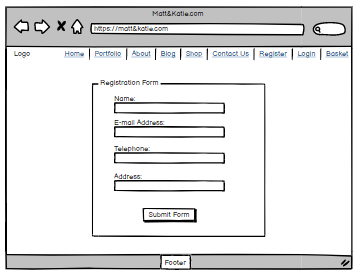
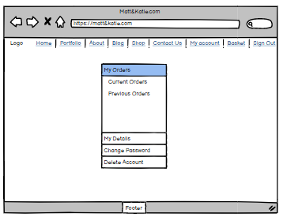
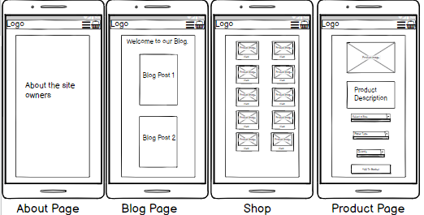

# **_Milestone-Project-4-Matt&Katie.com**

# **_Introduction:_**

The site matt&Katie.com is created for myself and my partner to post our photography and sell prints to our customers. On the site, visitors will also be able to read our blog where we will publish stories from our travels. Registered Users will be able to  comment their thoughts and any suggestions for a photography shoot. Registered users will also be able to update their shipping details i.e address or payment their details.

# **_Purpose:_**

The website above was created for the purpose of achieving the fourth Milestone Project for the Code 
Institute's Full Stack Developer course.The website was developed using the knowledge gained from all previous models
throughout the course and the final Django module.

# *User Stories:*

# *The Surface Plane:*

### *The font:*

With the site being focused to showcase photography, the lato font at weight 300 from google fonts has been chosen to allow the viewers to be able to read quickly and efficiently. Using such a sleek and simple font means that there is no attention taken away from the imagery. Along with the colours being used are very simple with just a black and white colour pallet so that the colours on the photographs are what the viewer notices first. The weight 300 provides a sleek look to the site, smaller weights were too thin and hard to read where in contrast greater font weight was too bulky and took away from the websites sleek design.

### *The imagery:*

The sites imagery only consists of the photographs that have been taken by the photographer. By doing this we don’t allow for any confusion as to what is owned by the siteadmin and therefore the photographers. There has been a decision to avoid background images so that it isn’t taking away from the foreground images again to avoid confusion or negative contrast between colours.

### *The colour scheme:*

The colour scheme for this site is monotone, since the main purpose of the site is to show off the photography, avoiding any 
vibrant colours has allowed the site to showcase it's purpose. Rather than adding lots of colours to the site the presentation has been worked on through adding things such as horizontal rules and card elements to diiferentiate site sections. Again the card elements are set to a pale grey in order to provide slight contrast from the background of the site to grab the users attention and distinguish themselves. This allows for a shadow effect behind the main object which is the imagery.

# *Skeleton:*

 
 
 

 
 
 
 
 
 
 
 
 

### *Database Design:* ###

# *Differences to design:*

In comparison to the initial design, the final layout of the site is far more sleek. The initial design included lots of boxes and thus seemed rather cluttered. In contrast the final design is far more sleek through the use of django crispy forms and bootstrap, it has allowed for a much more user friendly experience.
The initial nav-bar included too many links, the drop-down functionality taken from bootstrap has allowed this to be decreased by a large amount and thus looking far more pleasant to the eye and the functionality has also improved.
The inital home page design was a repeat of the portfolio page which was deemed unnecassary and would have just provoked more cluter on the site, instead the visitors of the site are greeted with a welcome message accompanied by a welcome image of the photographers. This also promotes the aim of the site which is to create an engaging community for people who love photography as oppose to a website which seems like its only purpose is to sell products.
Similarly through the use of the drop-down functionality of the bootstrap navbar, (for example) there are less pages as there no longer needs to be a page for the user to choose which category of photography they wish to browse. Instead they can select this from the dropdown.
Using django allauth for login and sign up has also allowed for the registration form to be shortened and the user can later choose to add their details but for pure registration only and e-mail and password is required.

# *Structure:*

Continuing from the above, the site has a sleek and minimalistic design, it flows well on laptops, bigger screens, medium and small devices. The structure varies between small and large devices in sense that it has been designed using mobile first design. all the features are displayed in single file on small screens by using bootsrap grid to give things the col-sm-12 classes. This stops the website from becoming so cluttered that it would be unusable on a small screen. Instead, when the user is reading they are focused on the paragraph they are reading and the picture comes below or above, but it is out of the way. An example of this is the about us page. Similarly, when browsing the shop or the gallery the user can scroll through and view each item one by one. As the screen get's wider, the layout grows with it and it begins to look even better on larger devices.

# *Scope:*

The planned features for the website are:

* Website Title/ Website Logo - The aim of this is to make the website look professional, and provide a link to the home page on larger screen devices.  

* Page Headings- Due to the vast feautures of the site each page has a heading on the top, the heading follows the same styling
throughout and ensures that the user isn't losing track of what page their on for example if they were to get distracted.

* A search bar- Anticipating many products and blog posts in the future, it will make it easy for users to find what they're searching for. For example a user maybe interested in buying an image of a specific place or they want to search for a blog post a friend has mentioned to them. Searching the site will enable a user to o this easier than having to manually look for what they want.

* Registration- A user can choose to register an account on the site, this allow them to save personal details, access previous order details and engage in blog posts by commenting their thoughts. 

* Login- A returning user can log back in and review all their previous orders, update persoal details and review their orders. 

* Admin- The admin section/superuser of the site can be used to add,edit and delete blog posts, gallery images and shop products.

* Flash messages- Functions such as registering, adding reviews, logging in and out of the site as well as editing
or removing reviews are all supported by flash messages which confirm the request have been actioned.

* Custom 404 and 500 error pages- Custom 404 page not found and 500 server error pages to ensure that a user can return to the sites home page hassle free should they come across one of these errors.

# *Website Features:*
### *Existing:*
* A website logo

* Page Headings

* A search bar- At the current stage users can only search the products using the search bar.

* Registration

* Login

* Admin Area.

* Flash messages- Using Toasts, flash messages have been used to display occurances within the site such as success or ail messages.

* Custom 404 and 500 error pages

### *Future:*

* Style the navbar in the mobile header so that it is more central, whilst it doesn't look bad or provide poor functionality it would possibly look better moving it more central.

* Adding commenting functionality to blog posts as at the moment there will not be user interaction in this part of the site, the posts are read me only and only admin are able to interact with the posts.

* Allow users to use the search function on the site for more than just the products in allignment with the planned features.

Reason for lack of these being included at this time is the time factor. Due to still learning the framwork, how it works, wat it is capable and so one sometimes things take longer than can be anticipated and deadlines have to be met.

# *Technologies:* 

## *Languages used:*

* HTML
* CSS
* Javascript
* python

## *Frameworks, Libraries and programs Used:*

* Bootstrap
    * Used to assist in the reponsivness and functionality of the site.
* Jquery
    * Used to help implement Materialize features with in the app.
* Django
    * The Django framework was used to develop the web app.
* MySQL
    * MySQL database was used to store the app data locally.
* Postgres
    * Postgres database was used to store the app data when deployed in Heroku.
* Heroku
    Heroku was used to deply this web app.
* Amazon Web Services (AWS)
    Used to store the site static folders( CSS and media files).
* Stripe Payment methods
    Stripe payment methods were used to handle secure payments on the site.
* Gmail
    Used to connect real email functionality.
* Django Countries
    Used to provide list of countries for user profile details and payment details.
* Django Crispy forms
    Used to Create neat looking forms by importing relevant forms into templates.
* Django Allauth
    Used to handle authorisation of user accounts within the site.
* Django Extensions
    Used to install pyparsing and pydot which I used to create the Erd.dot file.
* Visual Studio Code
    Installed briefy onto local machine as no documentation could be found on installing graphiz extenions in gitpod.
* Graphviz
    Installed to local machine to convert erd.dot file into erd.png file.
* Microsoft Office Excel
    Used to run testing of the site, allowing for a clean look of all the tests and testing results.
* Google Chrome Developer Tools
    * Google chrome built in developer tools were used to inspect page elements and help debug issues.
* Google Fonts
    * Google fonts are used throughout the project to import the Playfair Display and serif fonts.
* Font Awesome
    * Font awesome Icons were used for the Social media links contained in the Footer section of the website.
* Techsini
    * Multi Device Website Mockup Generator was used to create the Mock up image in the readme.md file.
* GitHub
    * GithHub is the hosting site used to store the source code for the Website.
* Git
    * Git is the version control software used to commit and push code to the GitHub repository 
    where the source code is stored.
* Balsamiq Wireframes
    * Used to create wireframes for User experience design.
* Favicon
    * Favicon.io was used to make the website favicon.

